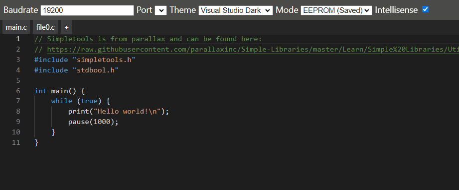
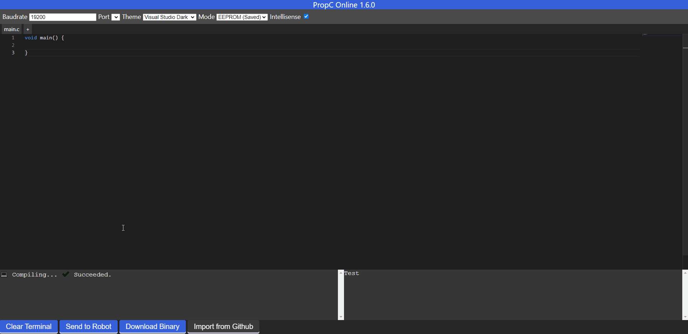

# PropC Online  
Program in C/C++ with [Propeller C](https://www.parallax.com/education/programming-languages/propeller-c) for Parallax Activity Boards.
This is an alternative to the solo editor and essentially [SimpleIDE](https://learn.parallax.com/tutorials/language/propeller-c/propeller-c-set-simpleide) in your browser.

Uses [monaco](https://github.com/microsoft/monaco-editor) for the editor, [BlocklyPropLauncher](https://github.com/parallaxinc/BlocklyPropLauncher) to communicate with your processor, and [Cloud-Compiler](https://github.com/parallaxinc/Cloud-Compiler) (hosted on [solo](https://solo.parallax.com/)) to compile the PropC code.

### 👉 [Try Me](https://dvvcz.github.io/PropC-Online) 👈

## Features
* Diagnostics in your IDE (warnings/editors) 📈
* Sleek monaco editor w/ dark & light themes
* Autocomplete from Parallax Standard Libraries
* Autosave your sessions (Configs at the top, alongside your code in every file)
* Multiple files to keep your project organized.
* Automatic compilation as you type
* Import straight from Github :octocat:
* Minimal, only really depends on the monaco editor actively developed by microsoft.

## Previews
### Multiple files

### Overview

## Why?

I created this project in my freetime during high school for use in my Vex Robotics projects. This is because the website provided by parallax to program the robot uses [block programming](https://developers.google.com/blockly) which is clunky and very quickly causes freezes, especially on school laptops. Students can use this as an alternative assuming they have basic knowledge of C programming.

It is MIT licensed for your convenience to learn from and use.

> As of June 2022, this project will not be actively developed considering I won't have access to a Parallax processor anymore since I've graduated. I will still try and keep it up to date and accept pull requests and issues.